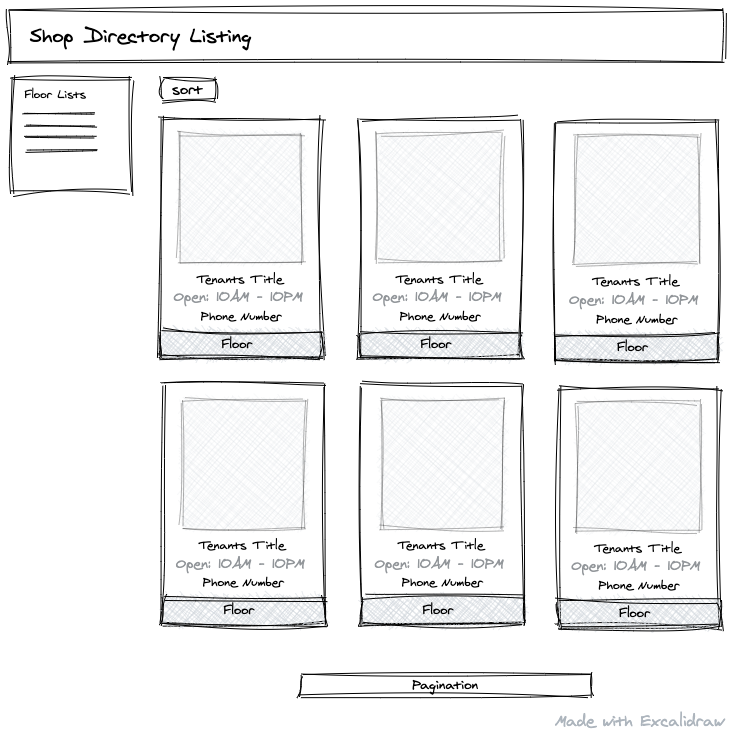

# Modern Monolith Shop Directory

This **Shop Directory** project was built for the purpose of testing the modern monolith architecture that is quite popular today, the stacks used for this project are Laravel, InertiaJS, ReactJS, TypeScript, and TailwindCSS.

This project attempts to provide an example of how to use the very popular front end technology ReactJS+TypeScript in a Laravel project. Without reducing favorite features in ReactJS such as SPA, Code Splitting, and so on.

## Usage
Don't forget to run `yarn artisan migrate` and `yarn artisan db:seed` before running this project.

Feel free to change database username, password inside `docker-compose.yml` and don't forget to update your .env file inside `src` folder

## Design

## Commands
| commands  | description  |
|---|---|
| yarn up  | is an alias of `docker-compose up -d --build site`, to start development server of this project  |
| yarn artisan  | is an alias of `docker-compose run --rm artisan` |
| yarn yarn  | is an alias of `docker-compose run --rm yarn` to run `yarn` command inside container |
| yarn npm  | is an alias of `docker-compose run --rm npm` to run `npm` command inside container |
| yarn php  | is an alias of `docker-compose run --rm php` to run `php` command inside container |

## Todos
#### Front End
- [x] Support InertiaJS with React TypeScript
- [x] React TypeScript Code Splitting
- [ ] Remove unused Tailwind class
- [ ] Pagination

#### Back End
- [ ] Adding phone number in tenants table
- [ ] Shared data type between TypeScript and PHP
- [ ] Pagination Support
- [ ] Filter Support
- [ ] Deploy to Vercel

## Contributing
Pull requests are welcome. For major changes, please open an issue first to discuss what you would like to change.

Please make sure to update tests as appropriate.

## License
[MIT](https://choosealicense.com/licenses/mit/)
